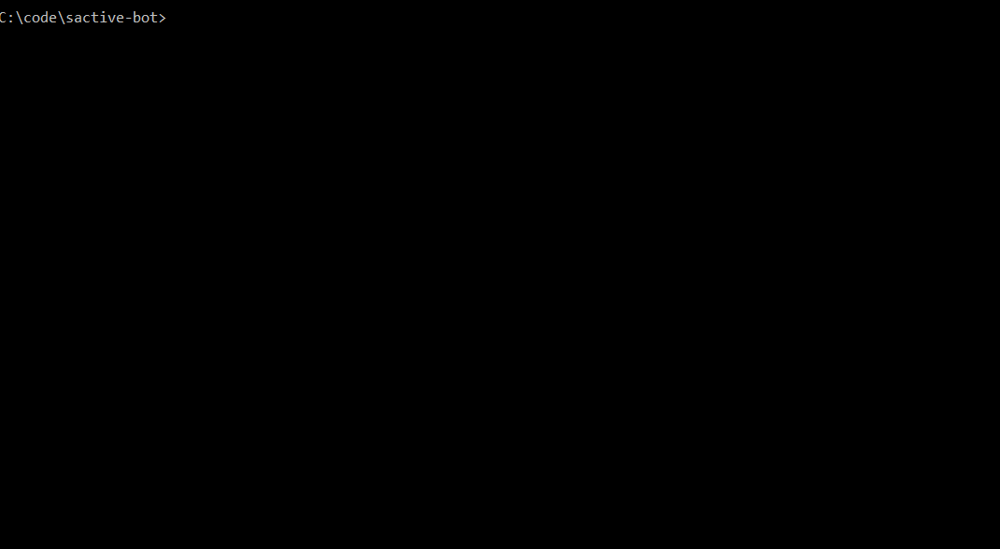
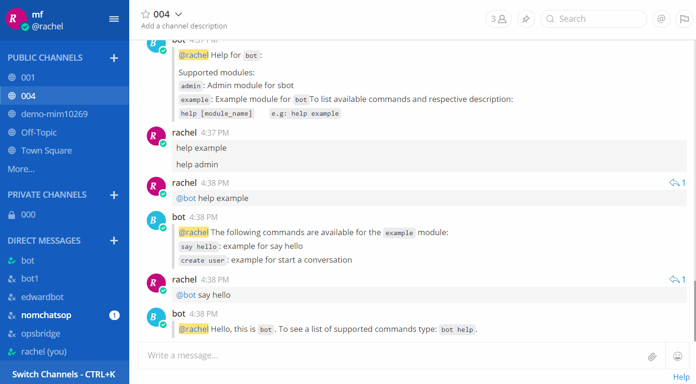

# sactive-bot
An extensible chat bot framework.

[](https://nodei.co/npm/sactive-bot/)

## Installation
```bash
npm install sactive-bot
```

## Requirements
- `NodeJs` version `v7.9+`

## Features
- WeChat Bot
- Slack Bot
- Mattermost Bot
- Microsoft Teams bot Bot
- Support create conversation for bot
- Misspelling
- Help for bot
- Conversation Manager
- Command API call
- Support integrate your own adatper

## Demo
Create a Mattermost bot:



Chat with bot:



## Documentations
- [Getting Started](docs/getting_started.md)
- [WeChat Bot](docs/wechat_bot.md)
- [Slack Bot](docs/slack_bot.md)
- [Mattermost Bot](docs/mattermost_bot.md)
- [Microsoft Teams bot Bot](docs/msteams_bot.md)
- [Writing your scripts](docs/scripts.md)
- [Conversation Guide](docs/conversation_guide.md)
- [External Adatper](docs/external_adapter.md)

## TODO
- unit test
- command authentication
- api server
  - api authentication
- render card
- crypto all sensitive information
- docker version, kubernetes yaml file
- scripts hot reload
- wechat
  - http://www.blogjava.net/yongboy/archive/2015/11/05/410636.html
  - api
    - https://github.com/Urinx/WeixinBot
  - login
    - http://www.tanhao.me/talk/1466.html/
    - QRCode terminal
- mattermost
  - api
    - https://www.npmjs.com/package/hubot-matteruser
    - https://api.mattermost.com/
- slack
  - api
    - https://github.com/slackapi/hubot-slack
- msteams
  - api
    - https://github.com/howdyai/botkit/blob/master/lib/TeamsAPI.js