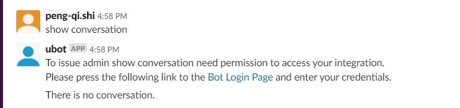

# Authentication

SActive bot provides a simple login web portal. It supports BasicAuth protocol.

## BasicAuth authentication protocol

### Registering authentication callback
Callback registration is accomplished by using the `robot.$.registerIntegration(config, authConfig)` method.
The `authConfig` parameter allows the passing of an object with configuration information for the authentication feature.

example:
```js
let basicAuthConfig = {
  adapter: 'basic', // optional, default is 'basic'
  TOKEN_TTL: 1800, // optional, default is 'basic'
  AUTH_TIMEOUT: 60, // optional, default is 'basic'
  authHandler: authenticateToProduct // required, should return a promise.
};
```

The `authenticateToProduct()` callback in the example looks like this:
```js
const authenticateToProduct = (username, password, userInfo) => {
  return new Promise((resolve, reject) => {
  robot.logger.info("Running the function: auth_method");
    if (username === 'admin' && password === 'Admin111') {
     resolve(createLoginResponse(200))
   }
    reject(new Error('System error'))
 });
};
```

- The arguments passed to the callback will depend on the authentication method. In the case of this example the product script is using `BasicAuth` and thus,
it expects `username`, `password` and `userInfo` as arguments.
  - `userInfo`
    - name, the username who @ the bot.
    - userId
    - roomId
  - The callback should return a Promise object. In the example above,
  - the Promise is resolved when the username and password are as expected (mimicking an authentication to a product API).
  - the Promise is rejected otherwise.

The example above uses hard-coded values to simulate an authentication. This should not be used in production. In a real world use case,
your product script should make an http request to the product's API or authentication service to authenticate the user.
example:
```js
const authenticateToProduct = (username, password) => {
  // Check that username and password are not nil.
  if (!username || !password) {
    return Promise.reject(new Error('Missing username or password'));
  }
  // Create base64 encoded token for BasicAuth.
  const token = new Buffer(`${username}:${password}`).toString('base64');

  // Setup fetch() request.
  const request = {
    method: 'POST',
    headers: {
      Authorization: `Basic ${token}`,
    },
  };

  robot.logger.debug(`Request to: ${PRODUCT_AUTH_ENDPOINT}`);

  // Perform request to verify credentials, i.e. authenticate.
  return fetch(PRODUCT_AUTH_ENDPOINT, request)
    .then((resp) => {
      // Handle if there was a response from server.
      robot.logger.info('Received OK response from fetch!');
      robot.logger.debug(resp);
      return Promise.resolve(createLoginResponse(resp.status));
    })
    .catch((e) => {
      // Handle an error in the request.
      robot.logger.info('Received error from fetch()!');
      robot.logger.debug(e);
      // Reject promise with the caught error.
      return Promise.reject(e);
    });
};
```

### Retrieving credentials in command callbacks
When authentication is enabled upon product script registration and a chat user has been authenticated against the product,
Bot will inject the credentials in the operation / command callback as such:
```js
let myCommandCallback = (response, _robot, authContext) => {
  # Access through authContext
};
```

### Example authentication workflow

1. Issue unauthenticated command:
2. After clicking on link, enter credentials in web page.
3. After successfully login in, go back to the chat platform and see your command result.




