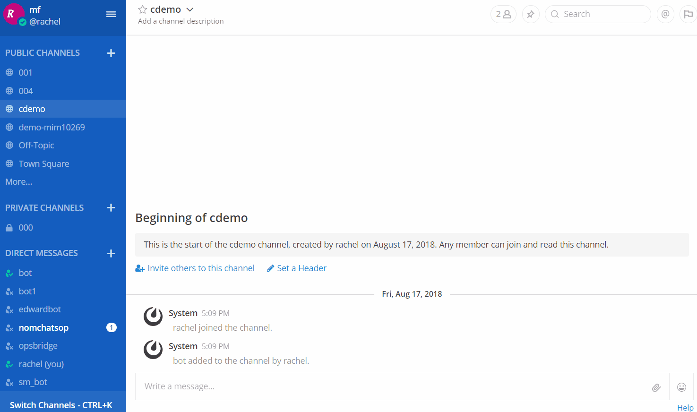
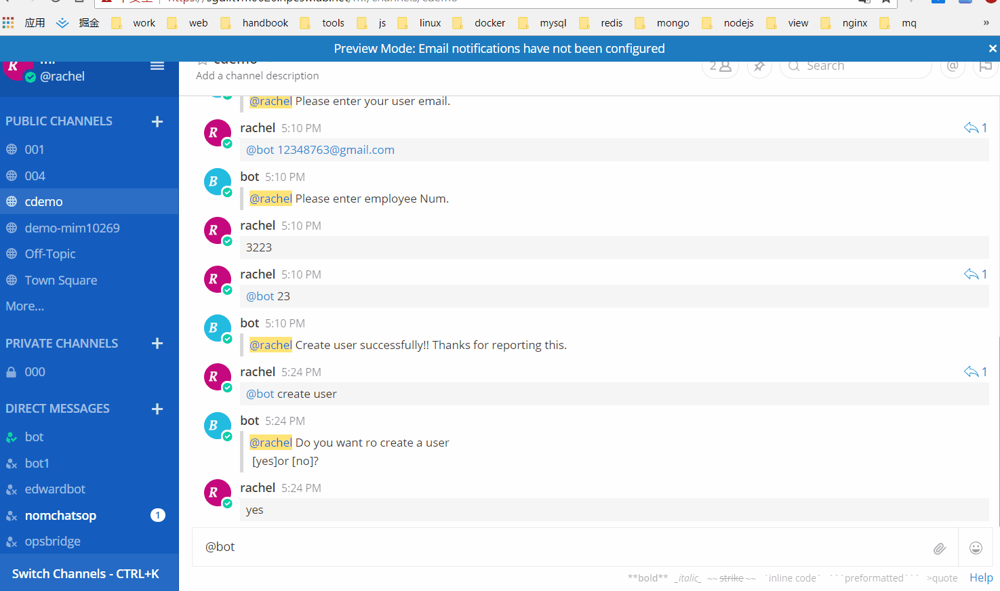

# Conversation Guide

<p align="center">
 Conversation:
</p>
<div align="center">
  
</div>

<p align="center">
 Conversation Manager:
</p>
<div align="center">
  
</div>


## `robot.$.conversation`
`robot.$.conversation` is a instance of [sbot-conversation](https://github.com/shipengqi/sbot-conversation).

Refer to the doc [How to create a conversation for bot](https://github.com/shipengqi/sbot-conversation).

## Conversation manager command
### show
Get conversations of bot.
```bash
show conversation [conversationId|all]
```

```bash
# get all conversations of bot
show conversation all

# get conversation by id
show conversation 56465621321

# get current active conversation
show conversation
```

### cancel
Cancel conversations of bot.
```bash
cancel conversation [conversationId|all]
```

```bash
# cancel all conversations of bot
cancel conversation all

# cancel conversation by id
cancel conversation 56465621321

# cancel current active conversation
cancel conversation
```

### resume
Resume a pending conversation of bot.
```bash
resume conversation [conversationId]
```

```bash
# resume conversation by id
show conversation 56465621321

# resume current active conversation
show conversation
```