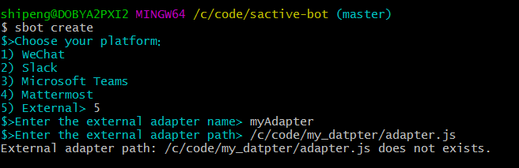

# External Adapter
If you want to integrate an external adapter, you should provide a configuration file named `config.yml` under your external adapter directory.
Then run the command `sbot create`.



## Adapter Example
Structure of the external adapter directory `example_adapter`:
- config.yml
- my_adapter.js

### [How to write your own adapter](https://hubot.github.com/docs/adapters/development/)

### Configuration yaml file
Based on [prompt](https://www.npmjs.com/package/prompt).

**Example**
```yml
PLATFORM:
  description: 'Choose your platform：\n1) WeChat \n2) Slack \n3) Microsoft Teams \n4) Mattermost \n5) External'
  pattern: /^[1-7]$/
  message: 'Choose a platform (between 1 and 7).'
```
Here's an overview of the properties:
```javascript
  {
    description: 'Enter your password',     // Prompt displayed to the user. If not supplied name will be used.
    type: 'string',                 // Specify the type of input to expect.
    pattern: /^\w+$/,                  // Regular expression that input must be valid against.
    message: 'Password must be letters', // Warning message to display if validation fails.
    hidden: true,                        // If true, characters entered will either not be output to console or will be outputed using the `replace` string.
    replace: '*',                        // If `hidden` is set it will replace each hidden character with the specified string.
    default: 'lamepassword',             // Default value to use if no value is entered.
    required: true                        // If true, value entered must be non-empty.
  }
```

More details, refer to [prompt document](https://www.npmjs.com/package/prompt).

